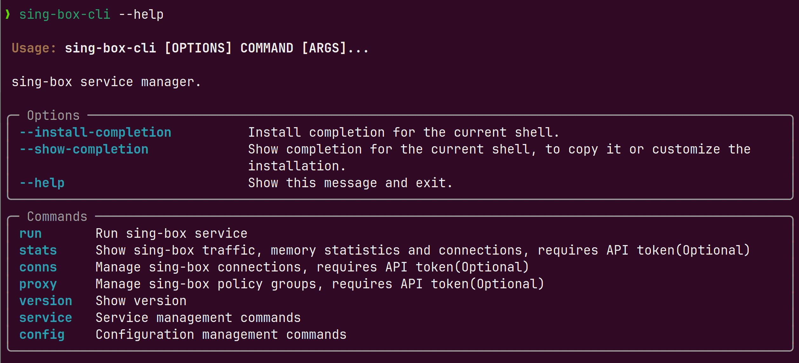

# Sing-Box CLI

🎤 Cross-platform sing-box service manager.



## Install

### uv

Windows

```powershell
powershell -ExecutionPolicy ByPass -c "irm https://astral.sh/uv/install.ps1 | iex"
```

Linux

```bash
curl -LsSf https://astral.sh/uv/install.sh | sh
```

### sing-box-cli

Install
```powershell
# windows
uv tool install sing-box-cli
```

```bash
# linux
uv tool install sing-box-cli
sudo ln -sf $(which sing-box-cli) /usr/local/bin/
sudo ln -sf $(which sbc) /usr/local/bin/
```

Install with specific sing-box version

```bash
uv tool install sing-box-cli --with sing-box-bin==x.y.z
```

Upgrade
```bash
uv tool upgrade sing-box-cli
```

> [!warning]
> stop service before upgrading in windows

## Run

Windows in Admin powershell

```powershell
sbc --help
```

Linux

```bash
sudo sbc --help
```
